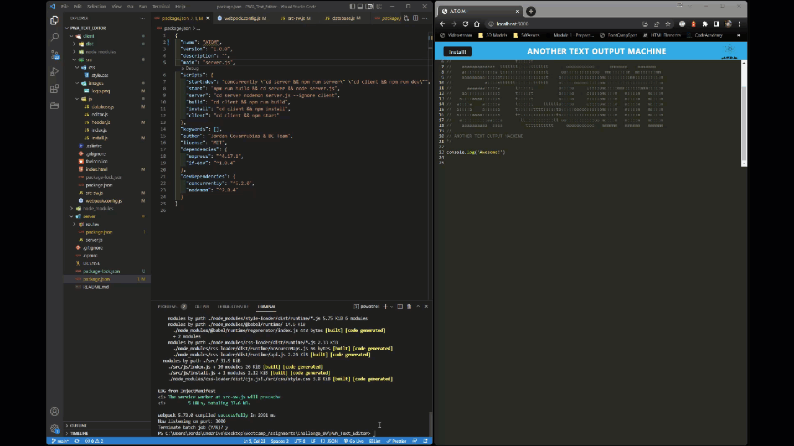

# PWA_Text_Editor

## Description:

My task this week is to build a text editor that runs in the browser. The app will be a single-page application that meets the PWA criteria. Additionally, it will feature a number of data persistence techniques that serve as redundancy in case one of the options is not supported by the browser. The application will also function offline.

To build this text editor, I will start with an existing application and implement methods for getting and storing data to an IndexedDB database. I will use a package called `idb`, which is a lightweight wrapper around the IndexedDB API. It features a number of methods that are useful for storing and retrieving data, and is used by companies like Google and Mozilla.

## Table of Contents

- **[Installation](#installation)**
- **[Usage](#usage)**
- **[Contribution](#contribution)**
- **[License](#license)**
- **[Git Info](#git-info)**
- **[Contact](#contact-me)**

# Installation

1. Run npm i

# Usage

1. Run npm i
2. Run npm start
3. Navigate to localhost/3000

||

Heroku Deployed Link:
https://atomtext-app.herokuapp.com/

1. Navigate to the above heroku link.

# Contribution

Open to any and all contributions!

# Git Info

Username: AuraFly
https://github.com/AuraFly

# Contact Me

[Contact Me](mailto:auraflydev@gmail.com)

# License

This application is covered under the MIT open source license.

Permission is hereby granted, free of charge, to any person obtaining a copy of this software and associated documentation files, to deal in the Software without restriction, including without limitation the rights to use, copy, modify, merge, publish, distribute, sublicense, and/or sell copies of the Software, and to permit persons to whom the Software is furnished to do so, subject to the following conditions:

The above copyright notice and this permission notice shall be included in all copies or substantial portions of the Software.

THE SOFTWARE IS PROVIDED 'AS IS', WITHOUT WARRANTY OF ANY KIND, EXPRESS OR IMPLIED, INCLUDING BUT NOT LIMITED TO THE WARRANTIES OF MERCHANTABILITY, FITNESS FOR A PARTICULAR PURPOSE AND NONINFRINGEMENT. IN NO EVENT SHALL THE AUTHORS OR COPYRIGHT HOLDERS BE LIABLE FOR ANY CLAIM, DAMAGES OR OTHER LIABILITY, WHETHER IN AN ACTION OF CONTRACT, TORT OR OTHERWISE, ARISING FROM, OUT OF OR IN CONNECTION WITH THE SOFTWARE OR THE USE OR OTHER DEALINGS IN THE SOFTWARE.
